<h1 align="center">Hey  I'm Martin</h1>
<h3 align="center">Web Developer</h3>

  

## 📌 About Me

- 🔭 I’m currently working on building web development projects.
- 🌱 I’m learning JavaScript deeply, and exploring front-end & back-end development.
- 👯 I’m open to collaborating on web projects and open source.
- 💬 Ask me anything about web development.
- 📫 How to reach me: [martin23017921@gmail.com]

## 📊 GitHub Stats & Trophies

  
  

  

  

  

## 🛠️ Languages & Tools

> ## Programming Languages

   

> ## Frontend

   

> ## Database

> ## Tools

  

  

## 🔗 Connect with Me

   

## 💬 Quote

<b> NEVER GIVE UP </b>

  

  

